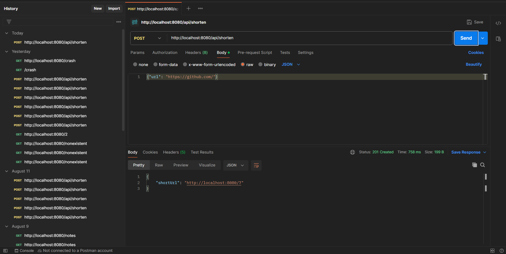

# URL Shortener

A production-style URL shortening service built with Spring Boot and PostgreSQL, with stateless JWT authentication and user-scoped link ownership.

**Status:** Layer 1 complete. Layer 2 in progress — JWT auth is done; caching, rate limiting, and click analytics are next.

---

## Demo



---

## Features

- Shorten long URLs to compact base62 codes
- Redirect from short URLs to originals (302) — public, no auth needed
- Click count tracking per link
- User registration with bcrypt password hashing
- Login issuing a signed JWT (HS256, 24h expiry)
- Stateless JWT authentication on all `/api/**` endpoints
- User-scoped URL ownership — each user only sees links they created
- Input validation with detailed, per-field error responses
- Global exception handling (400 / 401 / 404 / 500) with a consistent JSON shape
- Persistent storage via PostgreSQL with auto-schema management (Hibernate DDL)

## Tech Stack

- Java 21
- Spring Boot 4.1
- Spring Security 6 (stateless, custom JWT filter)
- JJWT 0.12.6
- PostgreSQL 17
- Spring Data JPA / Hibernate
- Bean Validation (Hibernate Validator)
- Maven

---

## API Documentation

| Method | Endpoint | Auth | Description | Status Codes |
|---|---|---|---|---|
| POST | `/api/auth/register` | — | Create a user account | 201, 400 |
| POST | `/api/auth/login` | — | Exchange credentials for a JWT | 200, 400, 401 |
| POST | `/api/shorten` | Bearer | Create a shortened URL | 201, 400, 401 |
| GET | `/api/urls` | Bearer | List the caller's URLs | 200, 401 |
| GET | `/{shortCode}` | — | Redirect to original URL | 302, 404 |

Authenticated endpoints expect the token in a standard header:

```
Authorization: Bearer <token>
```

### `POST /api/auth/register`

Username must be 3–20 characters (alphanumeric or underscore). Password must be at least 8 characters.

**Request:**
```json
{"username": "aditya", "password": "hunter2hunter2"}
```

**Response (201 Created):**
```json
{"message": "Registration is successful"}
```

Duplicate usernames return the standard 400 validation shape with `details[0].field = "username"`.

### `POST /api/auth/login`

**Request:**
```json
{"username": "aditya", "password": "hunter2hunter2"}
```

**Response (200 OK):**
```json
{"token": "eyJhbGciOiJIUzI1NiJ9..."}
```

**Bad credentials (401 Unauthorized):**
```json
{
    "status": 401,
    "error": "Unauthorized",
    "message": "Invalid username or password",
    "timestamp": "2026-08-15T10:23:45"
}
```

The same 401 is returned whether the username does not exist or the password is wrong, so the endpoint does not leak which usernames are registered.

### `POST /api/shorten`

Requires a valid JWT. The created link is owned by the authenticated user.

**Request:**
```json
{"url": "https://example.com/very/long/path"}
```

**Response (201 Created):**
```json
{"shortUrl": "http://localhost:8080/abc"}
```

**Validation errors (400 Bad Request):**
```json
{
    "status": 400,
    "error": "Bad Request",
    "message": "Validation failed",
    "details": [{"field": "url", "issue": "URL is required"}],
    "timestamp": "2026-08-15T10:23:45"
}
```

### `GET /api/urls`

Requires a valid JWT. Returns only the links belonging to the caller.

**Response (200 OK):**
```json
[
    {
        "longUrl": "https://example.com/very/long/path",
        "shortUrl": "http://localhost:8080/abc",
        "createdAt": "2026-08-15T10:23:45",
        "clickCount": 12
    }
]
```

### `GET /{shortCode}`

Public. Redirects (HTTP 302) to the original long URL and increments the click count on each visit.

**Not-found response (404):**
```json
{
    "status": 404,
    "error": "Not Found",
    "message": "Short code not found: abc",
    "timestamp": "2026-08-15T10:23:45"
}
```

---

## Local Setup

**Prerequisites:**
- Java 21
- PostgreSQL 17 running on `localhost:5432`
- A database named `urlshortener`

**Environment variables:**
- `DB_PASSWORD` — your PostgreSQL password

**Run:**
```bash
./mvnw spring-boot:run
```

The app starts on `http://localhost:8080`. Hibernate creates the `url` and `users` tables on first boot.

**Quick smoke test:**
```bash
curl -X POST http://localhost:8080/api/auth/register -H "Content-Type: application/json" -d "{\"username\":\"aditya\",\"password\":\"hunter2hunter2\"}"
```

---

## Engineering Decisions

**Base62 encoding for short codes.** Short codes are derived directly from the auto-generated database ID, eliminating collision checks and keeping URLs compact.

**DTOs separate from entities.** Request and response objects are separate classes from the database entity, preventing mass assignment vulnerabilities and decoupling the API contract from the database schema. `UrlSummaryResponse` also keeps internal fields like `id` and `userId` off the wire.

**Global exception handling via @ControllerAdvice.** A single class handles all exception-to-response translation, ensuring consistent JSON error format across every endpoint.

**HTTP 302 (temporary) over 301 (permanent) for redirects.** 302 ensures every visit hits the server, allowing accurate click count tracking. 301 would cache the redirect in browsers, breaking analytics.

**Optional<Url> for repository lookups.** Returning `Optional<Url>` instead of nullable references forces callers to handle the "not found" case explicitly, preventing NullPointerExceptions.

**Stateless JWT over server-side sessions.** No session store to replicate, so the app scales horizontally without sticky sessions — a natural fit for a service whose hot path is a single stateless redirect lookup.

**JWT filter authenticates but never rejects.** `JwtAuthFilter` populates the `SecurityContext` when a valid token is present and otherwise passes the request through untouched. Authorization stays entirely in `SecurityConfig`'s rule chain, which keeps the "who may access what" decision in one readable place and lets public endpoints work with or without a token.

**Redirects stay public, writes stay authenticated.** `GET /{shortCode}` is matched by a narrow regex (`[a-zA-Z0-9]+`) so the public rule cannot accidentally expose an `/api` path.

**BCrypt for password storage.** Per-password salting and a tunable work factor are built in, so hashes stay resistant as hardware improves.

---

## Known Limitations

- `jwt.secret` currently ships as a placeholder literal in `application.properties`. It should be externalized to an environment variable before any real deployment, alongside `DB_PASSWORD`.
- The base URL in short links is hardcoded to `http://localhost:8080`; it needs to become configurable for deployment.
- Test coverage is a single context-load smoke test — unit and integration tests are planned below.
- Because short codes come from sequential IDs, they are guessable. Ownership is enforced on `/api/urls`, but any known code is publicly resolvable by design.

---

## Roadmap

**Layer 2 — Production features (in progress):**
- ~~**JWT authentication** — register/login endpoints, user-scoped URL ownership~~ ✅
- **Redis caching** — cache short-code → long-URL lookups for hot links
- **Rate limiting** — per-user throttling on shorten and redirect endpoints
- **Click analytics** — track time, country, referrer per redirect
- **Test suite** — unit tests for base62/JWT, integration tests for auth and redirect flows

**Layer 3 — Deployment & operations:**
- **Docker** — containerize the app + Postgres via docker-compose
- **CI/CD** — GitHub Actions for build, test, deploy on push to main
- **Cloud deployment** — free-tier hosting (Render / Railway / cloud VM)
- **Monitoring** — Spring Boot Actuator endpoints
