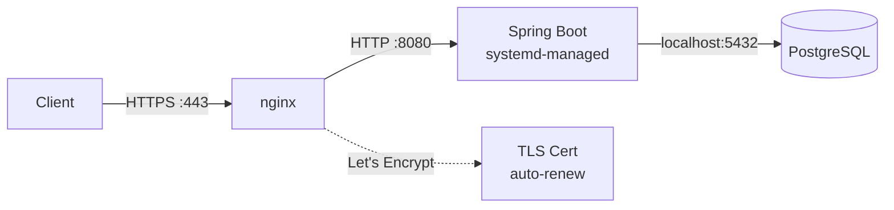

# URL Shortener

A production-style URL shortening service built with Spring Boot and PostgreSQL, with stateless JWT authentication and user-scoped link ownership.

**Live:** [go.adityag.dev](https://go.adityag.dev)

**Status:** Layer 1 complete and deployed to AWS EC2 behind nginx with HTTPS. Layer 2 in progress — JWT auth, Redis caching, and rate limiting are done; click analytics is next.

---

## Demo


---

## Features

- Shorten long URLs to compact base62 codes
- Redirect from short URLs to originals (302) — public, no auth needed
- Redis cache-aside on the redirect path, so hot links resolve without touching PostgreSQL
- Click count tracking per link, incremented asynchronously off the redirect path
- Token-bucket rate limiting backed by Redis — per-user on shorten, per-IP on the auth routes
- Graceful degradation — if Redis is unavailable, lookups fall back to PostgreSQL and rate limiting fails open rather than rejecting traffic
- User registration with bcrypt password hashing
- Login issuing a signed JWT (HS256, 24h expiry)
- Stateless JWT authentication on all `/api/**` endpoints
- User-scoped URL ownership — each user only sees links they created
- Input validation with detailed, per-field error responses
- Global exception handling (400 / 401 / 404 / 429 / 500) with a consistent JSON shape
- Persistent storage via PostgreSQL with auto-schema management (Hibernate DDL)

## Tech Stack

- Java 21
- Spring Boot 4.1
- Spring Security 7 (stateless, custom JWT filter)
- JJWT 0.12.6
- PostgreSQL 17+
- Redis 7 (caching + rate limit state)
- Spring Data JPA / Hibernate
- Spring Data Redis (Lettuce)
- Bean Validation (Hibernate Validator)
- JUnit 5 (parameterized tests)
- Docker / Docker Compose
- Maven

---

## API Documentation

Examples below show the production host. Running locally, short links come back as `http://localhost:8080/...` instead — the host is set by `APP_BASE_URL`.

| Method | Endpoint | Auth | Description | Status Codes |
|---|---|---|---|---|
| POST | `/api/auth/register` | — | Create a user account | 201, 400, 429 |
| POST | `/api/auth/login` | — | Exchange credentials for a JWT | 200, 400, 401, 429 |
| POST | `/api/shorten` | Bearer | Create a shortened URL | 201, 400, 401, 429 |
| GET | `/api/urls` | Bearer | List the caller's URLs | 200, 401 |
| GET | `/{shortCode}` | — | Redirect to original URL | 302, 404 |

Authenticated endpoints expect the token in a standard header:

```
Authorization: Bearer <token>
```

A request to an authenticated endpoint with a missing, malformed, or expired token is rejected by the security filter chain before it reaches a controller. It returns the same error shape as every other failure:

**Missing or invalid token (401 Unauthorized):**
```json
{
    "status": 401,
    "error": "Unauthorized",
    "message": "Missing or invalid authentication token",
    "timestamp": "2026-08-15T10:23:45"
}
```

### Rate limits

Three endpoints are throttled with a token bucket held in Redis. Each bucket allows a short burst up to its capacity, then refills at a steady rate, so normal use is unaffected while scripted abuse is not.

| Endpoint | Scoped by | Burst | Sustained rate |
|---|---|---|---|
| `POST /api/shorten` | authenticated user | 20 | 1 every 3s |
| `POST /api/auth/login` | client IP | 5 | 1 every 12s |
| `POST /api/auth/register` | client IP | 3 | 1 every 20s |

Scoping the auth routes by IP rather than by account is deliberate: a per-account limit on login would do nothing against credential stuffing, which tries many usernames from one source. `X-Forwarded-For` is honoured so the limit follows the real client through nginx rather than counting every request as coming from the proxy.

Exceeding a limit returns 429 with a `Retry-After: 60` header:

```json
{
    "status": 429,
    "error": "Too Many Requests",
    "message": "Rate limit exceeded. Try again shortly.",
    "timestamp": "2026-08-15T10:23:45"
}
```

### `POST /api/auth/register`

Username must be 3–20 characters (alphanumeric or underscore). Password must be at least 8 characters.

**Request:**
```json
{"username": "aditya", "password": "hunter2hunter2"}
```

**Response (201 Created):**
```json
{"message": "Registration is successful"}
```

Duplicate usernames return the standard 400 validation shape with `details[0].field = "username"`.

### `POST /api/auth/login`

**Request:**
```json
{"username": "aditya", "password": "hunter2hunter2"}
```

**Response (200 OK):**
```json
{"token": "eyJhbGciOiJIUzI1NiJ9..."}
```

**Bad credentials (401 Unauthorized):**
```json
{
    "status": 401,
    "error": "Unauthorized",
    "message": "Invalid username or password",
    "timestamp": "2026-08-15T10:23:45"
}
```

The same 401 is returned whether the username does not exist or the password is wrong, so the endpoint does not leak which usernames are registered.

### `POST /api/shorten`

Requires a valid JWT. The created link is owned by the authenticated user.

**Request:**
```json
{"url": "https://example.com/very/long/path"}
```

**Response (201 Created):**
```json
{"shortUrl": "https://go.adityag.dev/abc"}
```

**Validation errors (400 Bad Request):**
```json
{
    "status": 400,
    "error": "Bad Request",
    "message": "Validation failed",
    "details": [{"field": "url", "issue": "URL is required"}],
    "timestamp": "2026-08-15T10:23:45"
}
```

### `GET /api/urls`

Requires a valid JWT. Returns only the links belonging to the caller.

**Response (200 OK):**
```json
[
    {
        "longUrl": "https://example.com/very/long/path",
        "shortUrl": "https://go.adityag.dev/abc",
        "createdAt": "2026-08-15T10:23:45",
        "clickCount": 12
    }
]
```

### `GET /{shortCode}`

Public and not rate limited. Redirects to the original URL (HTTP 302) and records the visit.

The lookup is cache-aside: Redis is checked first, and on a miss the row is read from PostgreSQL and cached for 24 hours. The click count is incremented asynchronously, so it is eventually consistent — a redirect never waits on the database write.

**Not-found response (404):**
```json
{
    "status": 404,
    "error": "Not Found",
    "message": "Short code not found: abc",
    "timestamp": "2026-08-15T10:23:45"
}
```

---

## Quickstart with Docker

Requirements: Docker Desktop, or Docker Engine with Compose.

```bash
git clone https://github.com/Aditya1407g/UrlShortener.git
```
```bash
cd UrlShortener && docker-compose up
```

The app is available at `http://localhost:8080`. PostgreSQL and Redis start automatically alongside it, and Compose waits for both to pass a health check before launching the app. Data persists between restarts in named volumes (`postgres_data`, `redis_data`).

Only port 8080 is published — the database and Redis are reachable from the app container but not from the host. Credentials in `docker-compose.yml` are local-development defaults and are not used anywhere else.

---

## Local Setup

Running the services yourself, as an alternative to the Docker quickstart above.

**Prerequisites:**
- Java 21
- PostgreSQL 17+ running on `localhost:5432`
- A database named `urlshortener`
- Redis running on `localhost:6379`

Redis is optional for local development. Both the cache and the rate limiter fail open, so the app starts and every endpoint works without it — you just lose caching and throttling, and the log fills with connection warnings.

**Environment variables:**

Every setting is externalized in `application.properties`. All but `DB_PASSWORD` fall back to a local-dev default, so `DB_PASSWORD` is the only one you must set to run locally.

| Variable | Default if unset |
|---|---|
| `DB_PASSWORD` | *none — required* |
| `DB_URL` | `jdbc:postgresql://localhost:5432/urlshortener` |
| `DB_USERNAME` | `postgres` |
| `JWT_SECRET` | a local-dev-only literal (never used in production) |
| `APP_BASE_URL` | `http://localhost:8080` |
| `REDIS_HOST` | `localhost` |
| `REDIS_PORT` | `6379` |
| `REDIS_PASSWORD` | empty (no auth) |

**Run:**
```bash
./mvnw spring-boot:run
```

The app starts on `http://localhost:8080`. Hibernate creates the `url` and `users` tables on first boot.

**Quick smoke test:**
```bash
curl -X POST http://localhost:8080/api/auth/register \
  -H "Content-Type: application/json" \
  -d '{"username":"aditya","password":"hunter2hunter2"}'
```

---

## Testing

```bash
./mvnw test
```

`Base62EncoderTest` covers the short-code encoder, the piece of logic where an off-by-one silently corrupts every link it produces. Nine parameterized cases pin the boundaries where the alphabet rolls over, plus a determinism check that the same ID always encodes to the same code:

| Input | Expected | Boundary |
|---|---|---|
| `0`, `1` | `0`, `1` | zero and the first code |
| `10`, `35` | `a`, `z` | digits into lowercase, end of lowercase |
| `36`, `61` | `A`, `Z` | lowercase into uppercase, end of the alphabet |
| `62` | `10` | first two-character code |
| `3843`, `3844` | `ZZ`, `100` | two characters into three |

Alongside it, `UrlShortenerApplicationTests` is a context-load smoke test — it catches a broken bean graph or bad configuration on startup.

Planned next, in rough priority order:

- **Service tests** — cache-aside hit/miss behaviour and the token bucket's refill and exhaustion, against an embedded or mocked Redis
- **Controller tests** — `@WebMvcTest` slices asserting the JSON error contract and the auth rules on each route
- **Integration tests** — full request paths against real PostgreSQL and Redis via Testcontainers, so the cache, limiter, and persistence are exercised together rather than in isolation

---

## Deployment

Running in production on an AWS EC2 instance (Ubuntu 26.04): the Spring Boot JAR is managed by systemd, fronted by nginx terminating TLS with a Let's Encrypt certificate.

**Live:** [go.adityag.dev](https://go.adityag.dev)



### Config files

Both live in [`deploy/`](deploy/):

| File | Purpose |
|---|---|
| `url-shortener.service` | systemd unit — runs the JAR, injects secrets as environment variables, restarts on failure, caps memory for a free-tier instance |
| `url-shortener.nginx.conf` | nginx reverse proxy — listens on 443, forwards to Spring Boot on 8080, redirects port 80 to HTTPS |

### Production environment variables

Supplied by the systemd unit. `APP_BASE_URL` is what makes returned short links point at the real domain instead of `localhost`.

| Variable | Production value |
|---|---|
| `DB_URL` | `jdbc:postgresql://localhost:5432/urlshortener` |
| `DB_USERNAME` | `urlshortener_app` |
| `DB_PASSWORD` | *secret* |
| `JWT_SECRET` | *secret* — must be at least 64 characters for HS256 |
| `APP_BASE_URL` | `https://go.adityag.dev` |
| `REDIS_HOST` | `localhost` |
| `REDIS_PASSWORD` | *secret* — must match `requirepass` in `redis.conf` |

### Setup on a fresh Ubuntu 26.04 server

**1. Install dependencies**
```bash
sudo apt update && sudo apt install -y openjdk-21-jdk postgresql postgresql-contrib redis-server nginx certbot python3-certbot-nginx
```

Then lock Redis down. Set a password and confirm it only listens on loopback, since the app and Redis share one box and an exposed Redis needs no credentials by default:

```bash
sudo sed -i 's/^# *requirepass .*/requirepass your-strong-redis-password/' /etc/redis/redis.conf
```
```bash
grep -E '^(bind|requirepass)' /etc/redis/redis.conf && sudo systemctl restart redis-server
```

`bind` should read `127.0.0.1 -::1`, and `requirepass` must match `REDIS_PASSWORD` in the systemd unit. Because both the cache and the rate limiter fail open, a Redis that is misconfigured or unreachable will not break the API — it will quietly leave it unthrottled, so verify this rather than assuming it.

**2. Create the database and a dedicated app user**
```bash
sudo -u postgres psql
```
```sql
CREATE DATABASE urlshortener;
CREATE USER urlshortener_app WITH PASSWORD 'your-strong-password';
GRANT ALL PRIVILEGES ON DATABASE urlshortener TO urlshortener_app;
\c urlshortener
GRANT ALL ON SCHEMA public TO urlshortener_app;
```

That final grant on the `public` schema is required on PostgreSQL 15 and later, where non-owners can no longer create tables in `public` by default. Without it, Hibernate's schema generation fails on first boot.

**3. Build and upload the JAR**
```bash
./mvnw clean package -DskipTests
```
```bash
scp target/url-shortener-0.0.1-SNAPSHOT.jar ubuntu@<host>:/home/ubuntu/
```

**4. Install the systemd unit**
```bash
sudo cp deploy/url-shortener.service /etc/systemd/system/
```

Replace the `REPLACE_WITH_...` placeholders with the real secrets, then tighten the file permissions — unit files are world-readable by default and this one holds the DB password and JWT signing key:

```bash
sudo chmod 600 /etc/systemd/system/url-shortener.service && sudo systemctl daemon-reload
```

**5. Obtain the certificate, then install the nginx site**

The checked-in `url-shortener.nginx.conf` is the *post-certbot* state — it already references `/etc/letsencrypt/live/go.adityag.dev/`. On a genuinely fresh server those files do not exist yet, so `nginx -t` fails if you copy it in first. Point the domain's DNS A record at the instance, then let certbot generate the TLS block itself:

```bash
sudo certbot --nginx -d go.adityag.dev
```

Certbot writes the `listen 443 ssl` block and the port-80 redirect into the site config for you. Use the checked-in file as the reference for what the result should look like, or to restore a working config on a server that already has certificates.

```bash
sudo nginx -t && sudo systemctl reload nginx
```

**6. Start the service**
```bash
sudo systemctl enable --now url-shortener
```

### Operating it

```bash
sudo systemctl status url-shortener
```
```bash
sudo journalctl -u url-shortener -f
```

Application logs go to the systemd journal under the `url-shortener` identifier. The unit restarts on failure with a 10-second backoff.

---

## Engineering Decisions

**Base62 encoding for short codes.** Short codes are derived directly from the auto-generated database ID, eliminating collision checks and keeping URLs compact.

**DTOs separate from entities.** Request and response objects are separate classes from the database entity, preventing mass assignment vulnerabilities and decoupling the API contract from the database schema. `UrlSummaryResponse` also keeps internal fields like `id` and `userId` off the wire.

**Global exception handling via @ControllerAdvice.** A single class handles all exception-to-response translation, ensuring consistent JSON error format across every endpoint.

**HTTP 302 (temporary) over 301 (permanent) for redirects.** 302 ensures every visit hits the server, allowing accurate click count tracking. 301 would cache the redirect in browsers, breaking analytics.

**Optional<Url> for repository lookups.** Returning `Optional<Url>` instead of nullable references forces callers to handle the "not found" case explicitly, preventing NullPointerExceptions.

**Stateless JWT over server-side sessions.** No session store to replicate, so the app scales horizontally without sticky sessions — a natural fit for a service whose hot path is a single stateless redirect lookup.

**JWT filter authenticates but never rejects.** `JwtAuthFilter` populates the `SecurityContext` when a valid token is present and otherwise passes the request through untouched. Authorization stays entirely in `SecurityConfig`'s rule chain, which keeps the "who may access what" decision in one readable place and lets public endpoints work with or without a token. Because that rejection happens in the filter chain rather than in a controller, `@ControllerAdvice` cannot reach it — so a custom `AuthenticationEntryPoint` renders the same `ErrorResponse` body, keeping the 401 consistent with every other error the API returns.

**Redirects stay public, writes stay authenticated.** `GET /{shortCode}` is matched by a narrow regex (`[a-zA-Z0-9]+`) so the public rule cannot accidentally expose an `/api` path.

**BCrypt for password storage.** Per-password salting and a tunable work factor are built in, so hashes stay resistant as hardware improves.

**Cache-aside by hand rather than `@Cacheable`.** The redirect path checks Redis, falls back to PostgreSQL on a miss, and populates the cache on the way out. Writing it explicitly keeps the fallback visible and makes it obvious that a Redis failure is a degraded read rather than an error — behaviour that annotation-driven caching hides.

**Redis failures fail open.** Both `UrlCacheService` and `RateLimiter` catch their own exceptions and continue: a cache miss becomes a database read, and an unreachable rate limiter admits the request. For a link redirector, availability is worth more than strict throttling — the alternative is letting a Redis outage take down an API that PostgreSQL alone can still serve.

**Short Redis timeouts.** Connect and read timeouts are capped at 200ms so a slow or hung Redis cannot add latency to the redirect path. A cache that stalls is worse than no cache.

**The token bucket runs as a Lua script.** Evaluating the bucket in one atomic round trip stops two concurrent requests from reading the same token count and both being allowed. Refill is computed in floating point, so a sub-second gap still earns a fractional token and the limit refills smoothly instead of in one-second steps.

**Click counts increment asynchronously with an atomic UPDATE.** `@Async` keeps the database write off the redirect response path, and `SET click_count = click_count + 1` means overlapping redirects for the same code cannot lose each other's increments the way a load-modify-save would.

---

## Known Limitations

- Schema changes are applied by Hibernate (`spring.jpa.hibernate.ddl-auto=update`) rather than versioned migrations. This is convenient but unsafe for production schema evolution — it never drops or rewrites columns, and it offers no rollback. Flyway is the intended replacement.
- `spring.jpa.show-sql=true` is enabled unconditionally, so production logs every SQL statement to the journal. It should be switched off outside local development.
- Single EC2 instance with PostgreSQL co-located on the same box — no redundancy, and a restart is a brief outage.
- Test coverage is limited to a unit suite for `Base62Encoder` plus a context-load smoke test. Service, controller, and integration suites are planned — see [Testing](#testing).
- Because short codes come from sequential IDs, they are guessable. Ownership is enforced on `/api/urls`, but any known code is publicly resolvable by design.
- A Redis outage silently disables rate limiting rather than failing closed. That is the intended trade-off, but it means throttling is only as available as Redis.
- Cached entries are only evicted by their 24-hour TTL. That is safe while short codes are immutable and cannot be deleted; adding an edit or delete endpoint would require explicit invalidation.
- Click counts are eventually consistent. The increment is fired asynchronously after the response, so a redirect that completes during a database outage is not retried and that click is lost.
- The redirect endpoint is not rate limited, since it is the one path expected to take real traffic and is served from cache. A caching CDN or nginx-level limit is the better control there than an application filter.

---

## Roadmap

**Layer 2 — Production features (in progress):**
- ~~**JWT authentication** — register/login endpoints, user-scoped URL ownership~~ ✅
- ~~**Redis caching** — cache short-code → long-URL lookups for hot links~~ ✅
- ~~**Rate limiting** — token bucket in Redis; per-user on shorten, per-IP on the auth routes~~ ✅
- **Click analytics** — endpoints exposing time, country, and referrer per redirect
- **Test suite** — service, controller, and integration coverage on top of the existing `Base62Encoder` unit tests

**Layer 3 — Deployment & operations:**
- ~~**Cloud deployment** — AWS EC2, systemd-managed, nginx reverse proxy, HTTPS via Let's Encrypt~~ ✅
- ~~**Docker** — app, PostgreSQL, and Redis via docker-compose with health checks and named volumes~~ ✅
- **CI** — GitHub Actions running the build and test suite on every push
- **CD** — automatic deploy to EC2 on merge to main
- **Database migrations** — replace Hibernate `ddl-auto` with Flyway
- **Monitoring** — Spring Boot Actuator endpoints

---

**Built by Jyothiraditya Gullapalli** — backend developer targeting SDE / internship roles in India.

Connect: [GitHub](https://github.com/Aditya1407g) | [LinkedIn](https://www.linkedin.com/in/jyothiradityag) | [Email](mailto:jyothiradityagullapalli@gmail.com)
